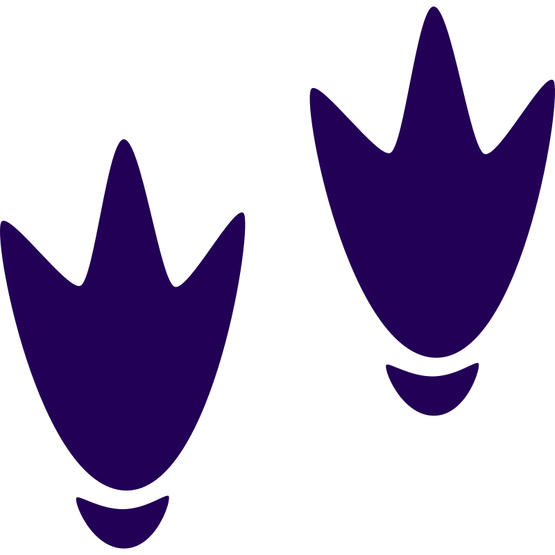

<div align="center">
  <picture>
    
  </picture>
<br>

<h2>Vizier</h2>

[](https://github.com/CogitatorTech/vizier/actions/workflows/tests.yml)
[](https://ziglang.org/download/)
[](https://github.com/CogitatorTech/vizier/blob/main/LICENSE)

A database advisor and tuner for DuckDB

</div>

---

Vizier is a tool for analyzing and tuning DuckDB databases.
It provides a set of functions to capture queries from a workload, analyze the physical design of the database,
and generate recommendations for improving query performance.
It is implemented as a DuckDB extension in Zig.

### Features

* Capture query patterns and execution stats
* Inspect current physical design (indexes, table sizes, cardinalities)
* Analyze the workload to find bottlenecks
* Recommend changes (indexes, sort orders, Parquet layouts, summary tables)
* Apply recommendations with dry-run support
* Benchmark before/after impact

---

### Quickstart

#### Build from Source

```bash
# Clone with submodules
git clone --recursive https://github.com/CogitatorTech/vizier.git
cd vizier

# Build the extension with metadata
make build-all

# Run unit tests
make test

# Try it interactively
make duckdb
```

#### Simple Example

```sql
LOAD vizier;

-- Capture queries from your workload
SELECT * FROM vizier_capture_query('SELECT * FROM events WHERE account_id = 42 AND ts >= DATE ''2026-01-01''');
SELECT * FROM vizier_capture_query('SELECT count(*) FROM orders GROUP BY customer_id');
SELECT * FROM vizier_capture_query('SELECT * FROM events WHERE account_id = 42 AND ts >= DATE ''2026-01-01''');

-- Persist captured queries to metadata tables
SELECT * FROM vizier_flush();

-- View workload summary (ordered by frequency)
SELECT * FROM vizier.workload_summary;
```

```
┌─────────────────────┬──────────────────────────────────────────────────────┬─────────────────┬────────────────────────────┬─────────────┐
│     query_hash      │                     sample_sql                       │ execution_count │         last_seen          │ avg_time_ms │
├─────────────────────┼──────────────────────────────────────────────────────┼─────────────────┼────────────────────────────┼─────────────┤
│ 5740047087559058606 │ SELECT * FROM events WHERE account_id = 42 AND ...   │               2 │ 2026-03-22 11:41:28.453727 │         0.0 │
│ 5575179023285527722 │ SELECT count(*) FROM orders GROUP BY customer_id     │               1 │ 2026-03-22 11:41:28.451424 │         0.0 │
└─────────────────────┴──────────────────────────────────────────────────────┴─────────────────┴────────────────────────────┴─────────────┘
```

#### Current API

| Function                      | Type           | Description                                  |
|-------------------------------|----------------|----------------------------------------------|
| `vizier_version()`            | Scalar         | Returns the extension version                |
| `vizier_capture_query(sql)`   | Table function | Captures a query for workload analysis       |
| `vizier_flush()`              | Table function | Persists captured queries to metadata tables |
| `vizier.workload_summary`     | View           | Summary of captured workload by frequency    |
| `vizier.workload_queries`     | Table          | Raw captured query data                      |
| `vizier.workload_predicates`  | Table          | Predicate tracking per query                 |
| `vizier.recommendation_store` | Table          | Generated recommendations                    |
| `vizier.applied_actions`      | Table          | Applied recommendation log                   |
| `vizier.benchmark_results`    | Table          | Before/after benchmark data                  |

---

### Contributing

See [CONTRIBUTING.md](CONTRIBUTING.md) for details on how to make a contribution.

### License

This project is licensed under the MIT License (see [LICENSE](LICENSE)).

### Acknowledgements

* The logo is from [SVG Repo](https://www.svgrepo.com/svg/117247/duck-footprints) with some modifications.
